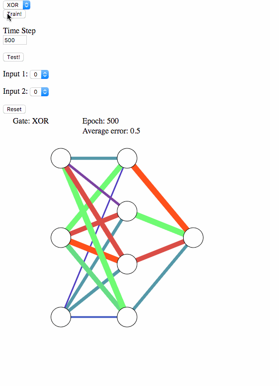

# NeuralNet_BackPropVisualization
This neural network tool visualizes the weight matrix dynamics during the training of a simple neural network on various logic gates (XOR, AND, OR).

Select a logic gate from the drop-down at anytime to switch the training direction of the network. Pick a time step over which to iterate during training. Click train to train the network.

The edges utilize the color and edge-weight channels to convey both sign and magnitude, respectively, of the neural network weights. The color of of the edge corresponds to the weight's sign: red is negative, green is positive, and dark blue is in between about 0. The edge-weight corresponds to the magnitude of the weight.

At any point in training, a test input can be generated and fed to the network to observe the neural network result compared to the expected result. In addition, the information displayed indicates the total epoch training time the network has undergone, in addition to the percent error for the current logic gate training task.

</img>
